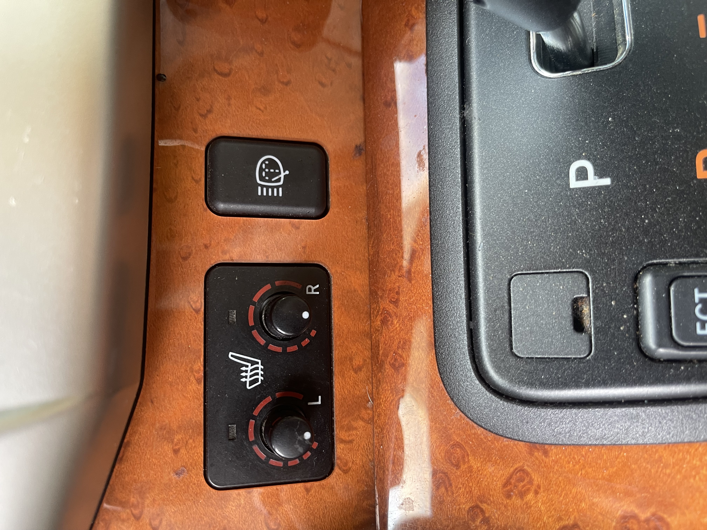
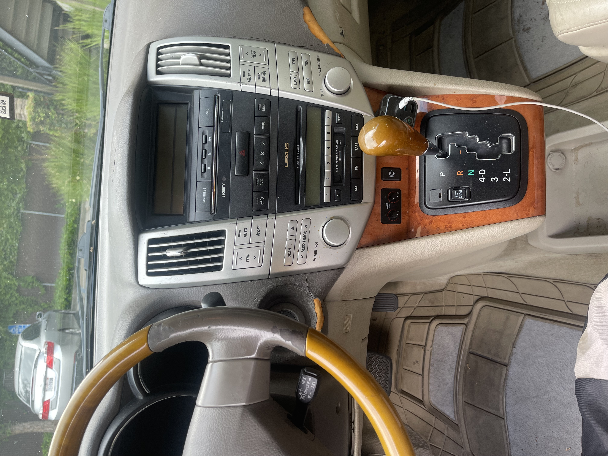
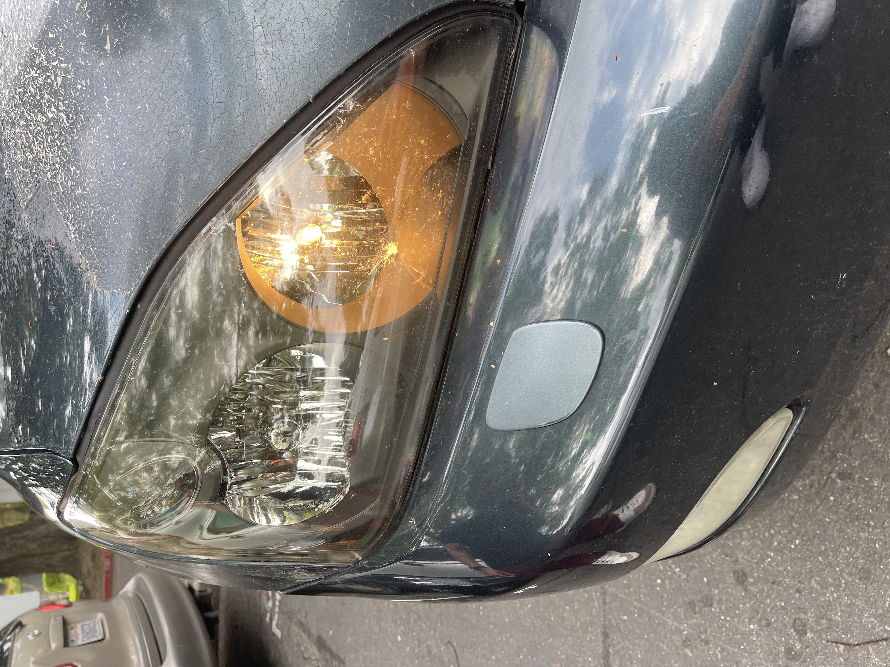
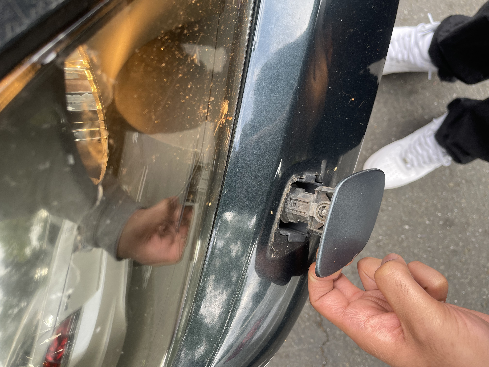

# UX Journal #1

Last year, I got a different car after my last one was totaled by my brother. I was looking for a car for a little bit, but I eventually ended up getting a 2004 Lexus RX 330. Right away, I noticed there were way more buttons in this car compared to my old 2001 Toyota Tundra, which I guess is expected.At first, I was actually pretty impressed by all the features. A lot of them were easy to understand, like the automatic windows, the automatic trunk opening, and the seat warmer knobs. Even though I was a little confused about why the seat warmer knobs could be pushed in without anything happening, most of the controls still made sense pretty quickly.

However, there was one button near the center console that I didn’t understand at all. It had a small symbol on it, and I kind of had a feeling it had something to do with the lights. At first, I thought it controlled the fog lights. The symbol looked like lights, but at the same time it also kind of looked like wipers, which made it confusing. Because of that, I wasn’t really sure what it was supposed to do.

 
 

This is where the idea of **affordances** comes in, which means how a design suggests what actions you can take. The button looked pressable, so I knew I could push it, but it didn’t clearly suggest what would happen after I pressed it. There was also an issue with **visual mapping**, which is how the appearance of a control helps you understand what it affects. The symbol didn’t clearly map to headlights being sprayed with water, so I couldn’t connect the button to its actual function. One day, I decided to just press it and see what would happen. When I pressed it, nothing seemed to change. I didn’t hear anything, didn’t see anything, and there was no clear response from the car. So I just assumed the button didn’t do anything or maybe was broken.

Later on, I got curious again and ended up looking it up to see what the button actually did. After doing a little research, I found out it was supposed to spray washer fluid onto the headlights. I couldn’t tell whether it was working or not  because I would have to press it and then run out the car to see if it was working.  To make sure, I tried pressing it again while having someone stand outside the car and watch. That’s when I finally realized it actually sprays the headlights. I didn’t notice it before because I can’t see the front of the car while driving, and also because there was a leak in the washer fluid reservoir, so sometimes nothing would even come out when I pressed it.

This experience relates to the **feedback principle**, which means a system should clearly show the user what happened after an action. In this case, the feedback was very weak. From inside the car, there was no clear indication that anything had happened, so it felt like the button didn’t work at all.

It also connects to the idea of a **mental model**, which is what a user expects something to do based on past experience. I expected the button to control something related to lights, like fog lights, not spray water. Since it didn’t match my expectations, it caused confusion. Additionally, it is not in the space where you’d expect for something like this to be. I’ve seen something similar online but it usually is connected to where you would spray your windshield. At the same time, the car has its own **conceptual model**, which is how the system is actually designed to work. In the car’s design, this button is meant to clean the headlights, but that idea wasn’t clearly communicated to me as the user.

That being said, the feature itself is actually useful. Cleaning the headlights can improve visibility, especially at night. The problem isn’t the feature—it’s how difficult it is to understand and notice. For an older car this concept was pretty cool to have but to improve this experience, the car could provide better feedback, like a dashboard indicator showing that the headlight washers were activated. The button could also use a clearer icon or label so users immediately know what it does. Even a small sound or message could help confirm that the action worked.

Overall, this experience showed me how important it is for systems to clearly communicate with the user. Even a working feature can feel completely useless if the user has no idea it’s actually doing something.
